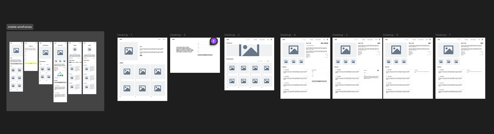
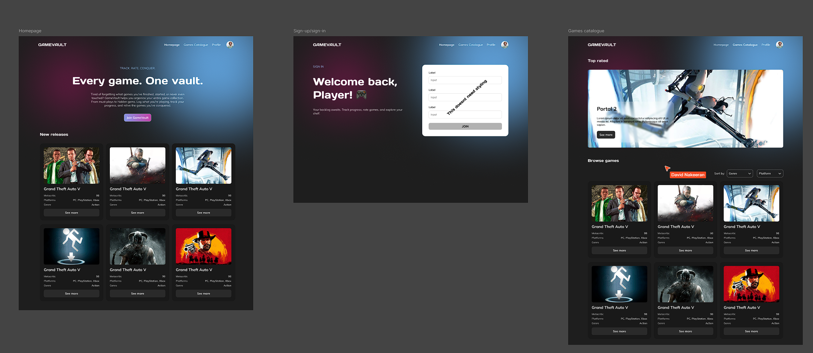
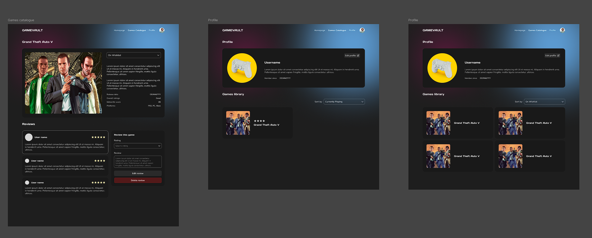
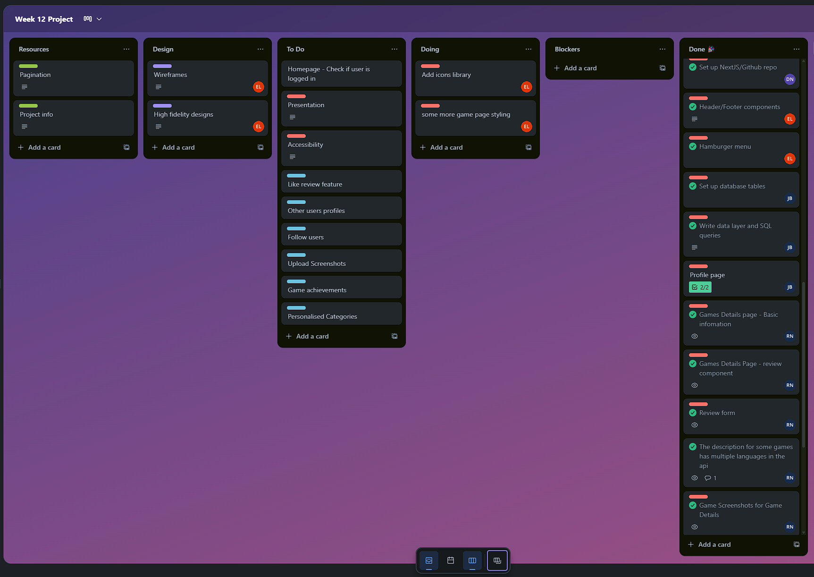
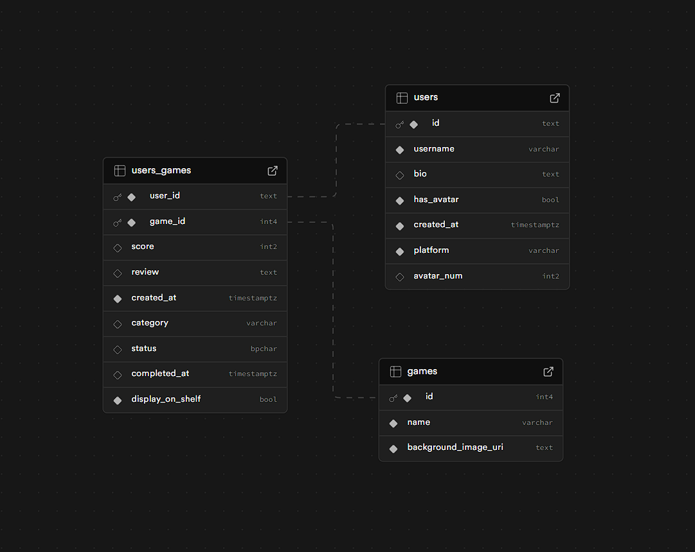

# Final Project - GameVault

By David, Elena, Ryan and Jason for Tech Educators Software Development course

## How to use

1. First head to our deployment link - https://week-12-group-project.vercel.app/
2. Sign up at the top right using Clerk. You’ll then be redirected to create a profile for our app.
3. Once you have an account, you can add games to your library and leave reviews! This can be done by clicking “See More” on any of the games.
4. You can also use the search bar to find a specific game.

## Problem Domain

- I want a personal video game tracker that lets me log, rate, and categorize the games I’ve played, want to play, or am currently playing.

## User Stories

🐿️ As a user, I want to sign up and log in securely using Clerk so that I can interact with the app and edit my user profile.

🐿️ As a user, I want multiple pages to organize information, including a page to show my personal game log.

🐿️ As a user, I want to search for games, visit their details page, and add them to my library.

🐿️ As a user, I want to see an error/not-found page (using error.js or not-found.js) if I try to visit a non-existent page.

🐿️ As a user, I want to create and manage my profile, including adding information like a biography, so that I can personalise my account.

🐿️ As a user, I want to track game status (Not Selected, Wishlist/Want to play, Ongoing, Completed, Dropped).

🐿️ As a user, I want to rate and review games I’ve played.

🐿️ As a user, I want to filter games by platform and genre.

## Planning

Our team used various tools to collaborate, including:

- Discord group chat
- Google docs
- Trello
- Figma

## Resources

- We used the RAWG API to fetch game data – https://api.rawg.io/docs/#operation/games_list
- Supabase was used to create and manage our database
- Clerk was used for authentication

## What worked well

- We completed all of our main user stories set when we started planning
- Our code is readable and includes comments to explain complex logic and decisions
- We implemented full CRUD functionality for reviews (Create, Read, Update, Delete), linked to the user
- Forms correctly handle and submit data, and enforce data requirements when needed
- Our code features a broad range of javascript features
- Our app uses the Next.js framework and also includes third party libraries
- Our app uses dynamic routes and parameters and has filtering and sorting for our games
- Clerk is implemented into our app and is used for the user profiles and for submitting reviews
- We used useState to manage certain information being displayed
- We used multiple different apps for planning and kept it all clear and consise so that everyone was on the same page
- We used sematic HTML where possible and added alt text to images for accessiblility reasons
- Our app is deployed to Vercel and includes a README.md to help others understand how to use it
- Thoughout the project we used git rules to protect our main branch and everytime we committed our separate branches we added clear messages that describe what we did. Each commit needed to be approved by at least 1 other member of our team.

## How could we further enhance this app

- Adding separate profile pages for each user, allowing users to visit profiles other than their own — this was a stretch goal we didn’t reach
- Adding custom filters for filtering games on our profiles was not achieved, we do however have the basic MVP filtering

## Individual thoughts

### David

-

### Elena

-

### Ryan

- We all worked really well as a team to create this app, and achieving our MVP
- I made the games details page and everything that came with it like the reviews and adding the game to your library feature
- I started work on using tailwind to style the page, and Elena very kindly helped to finish and clean it up!
- We had great discussions about what to do throughout the project, we never really had any conflicts, and if we did they were very minor and handled very professionally
- It was a pleasure to work with everyone and I'm really happy with our final project

### Jason

-
